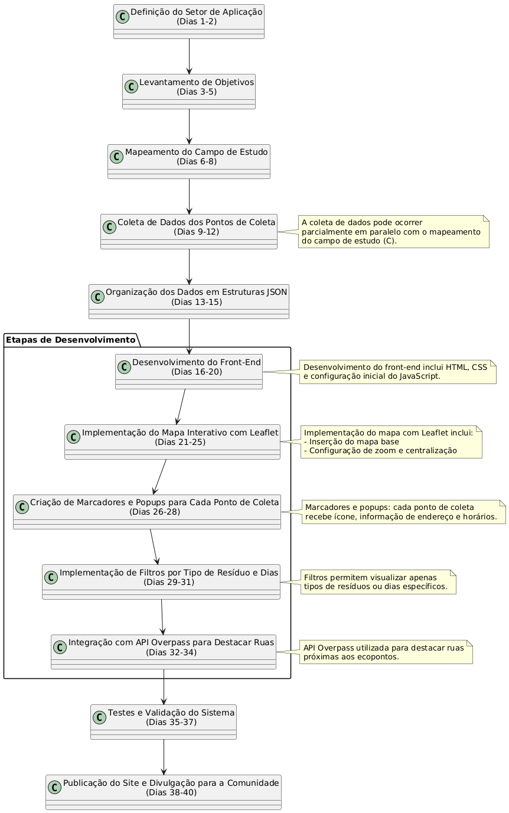

# Projeto de Extensão: Rotas de Descarte de Lixo Reciclável no Sítio Cercado

## Autor
**Alexandre** – estudante de Análise e Desenvolvimento de Sistemas (ADS) na UNINTER  

## Descrição do Projeto
Este projeto tem como objetivo desenvolver um **site funcional e de fácil acesso** que apresente as rotas de descarte de lixo reciclável no bairro **Sítio Cercado**, em Curitiba/PR. A plataforma busca facilitar o acesso da população local a informações sobre coleta seletiva, incentivando práticas corretas de descarte e reciclagem, além de estimular a participação ativa dos moradores.




## Objetivos
- Desenvolver um site funcional e de fácil acesso que apresente as rotas de descarte de lixo reciclável no bairro Sítio Cercado.  
- Mapear os pontos de coleta e as rotas existentes para descarte de resíduos recicláveis na comunidade local.  
- Divulgar informações sobre práticas corretas de descarte e reciclagem para sensibilizar os moradores do bairro.  
- Estimular a participação ativa da população no processo de reciclagem por meio do uso da plataforma digital.  

## Setor de Aplicação
O projeto será implementado no bairro **Sítio Cercado**, localizado na região sul de Curitiba/PR. A área é predominantemente residencial, com elevada densidade populacional e desafios relacionados à **gestão de resíduos sólidos urbanos**, principalmente no que se refere ao descarte e à destinação adequada de materiais recicláveis.  

A iniciativa visa contribuir para a **melhoria das práticas de descarte de resíduos recicláveis** por meio de um site que disponibiliza informações claras e acessíveis sobre as rotas de coleta, promovendo conscientização ambiental e incentivando hábitos sustentáveis entre os moradores.

## Tecnologias Utilizadas
- **Front-end:** HTML, CSS e JavaScript  
- **Frameworks/Bibliotecas:** TailwindCSS (estilização)  
- **Mapas interativos:** Leaflet + OpenStreetMap  
- **APIs:** Overpass API para consulta de ruas no OpenStreetMap  

## Implementação do Código

### 1. Mapa Interativo
O mapa é criado utilizando a biblioteca **Leaflet**, com OpenStreetMap como camada base:

```javascript
const map = L.map('map').setView([-25.5380, -49.2820], 14);
L.tileLayer('https://{s}.tile.openstreetmap.org/{z}/{x}/{y}.png', {
  attribution: '© OpenStreetMap contributors'
}).addTo(map);
```

### 2. Ícones Personalizados
Os pontos de coleta são representados com ícones personalizados:

```javascript
const recyclingIcon = L.divIcon({
  html: '<div style="background-color: #22C55E; width: 30px; height: 30px; border-radius: 50%; ..."></div>',
  className: 'custom-div-icon',
  iconSize: [30, 30],
  iconAnchor: [15, 15],
});
```

### 3. Renderização de Pontos de Coleta
```javascript
function renderPoints(filteredPoints) {
  markers.forEach(marker => map.removeLayer(marker));
  markers = [];

  filteredPoints.forEach(ponto => {
    const marker = L.marker([ponto.lat, ponto.lng], { icon: recyclingIcon }).addTo(map);
    marker.bindPopup(`
      <h3>${ponto.nome}</h3>
      <p>${ponto.endereco}</p>
      <p>Materiais: ${ponto.materiais.join(', ')}</p>
      <p>Horário: ${ponto.horario}</p>
      <p>Contato: ${ponto.telefone}</p>
    `);
    markers.push(marker);
  });
}
```

### 4. Filtro de Tipos de Resíduos
```javascript
function filterPoints() {
  const trashType = document.getElementById('trash-type-filter').value;
  const filtered = pontosColeta.filter(ponto => !trashType || ponto.materiais.includes(trashType));
  renderPoints(filtered);
}
```

### 5. Destacar Rua no Mapa
```javascript
function highlightStreet(streetName) {
  currentHighlights.forEach(layer => map.removeLayer(layer));
  currentHighlights = [];

  const query = `[out:json][timeout:25];way["name"="${streetName}"]["highway"](${bbox});out geom;`;
  fetch('https://overpass-api.de/api/interpreter?data=' + encodeURIComponent(query))
    .then(response => response.json())
    .then(data => {
      data.elements.forEach(way => {
        const coords = way.geometry.map(g => [g.lat, g.lon]);
        const polyline = L.polyline(coords, { color: 'red', weight: 5 }).addTo(map);
        currentHighlights.push(polyline);
      });
    });
}
```

### 6. Interação com o Usuário
- Filtros de dias da semana atualizam dinamicamente o mapa e a lista de pontos, por enquanto neste protótipo está em fase de teste.  
- Cada ponto possui um cartão informativo na lateral com detalhes de horário, contato e materiais aceitos.
